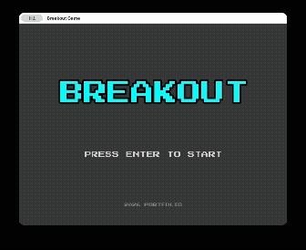

# 🧱 Breakout (C++ / SFML)

C++17とSFML 3.0を用いてゼロから設計・開発したブロック崩しゲームです。
ゲームエンジンの機能に頼らず、メモリ管理、シーン遷移、衝突判定などのゲームループの基盤を自作することで、低レイヤーの設計能力とモダンC++のコーディングスキルを習得することを目的としています。



## 📅 開発期間 (Development period)
2026年2月

## 🛠 技術スタック (Tech Stack)s

* **Language:** C++17
* **Library:** SFML (Simple and Fast Multimedia Library) 3.0.0
* **Build System:** CMake (FetchContentによる依存関係の自動解決)
* **IDE:** VS Code
* **Platform:** macOS / Windows / Linux

## 🚀 技術的なこだわり (Technical Highlights)

このプロジェクトでは、単に動作するだけでなく「拡張性」と「保守性」を意識した設計を行いました。

### 1. シーン管理システム (State Pattern)
`Scene` 基底クラスを継承した `TitleScene`, `GameScene`, `GameClearScene` を作成し、ステートパターンを用いてゲームの進行を管理しています。
* 各シーンは疎結合に保たれ、`std::function` コールバックを通じてのみ遷移を行います。
* これにより、新しいシーン（設定画面など）の追加が容易です。

### 2. 物理演算とゲームロジックの分離 (Separation of Concerns)
衝突判定を行う `CollisionManager` は物理的な計算のみを担当し、スコア加算などのゲームルールには関与しません。
* 物理演算の結果（衝突したブロック数など）を返し、それを受け取った `GameScene` がスコアを更新する設計にしました。
* これにより、物理挙動のバグとゲームルールのバグを切り分けてデバッグ可能です。

### 3. モダンC++ (Modern C++) の活用
生のポインタの使用を避け、スマートポインタ（`std::unique_ptr`）による所有権の明確化とRAIIイディオムを徹底しています。
* メモリリークのリスクを排除し、安全なリソース管理を実現しました。
* コンパイル時定数 (`constexpr`) を活用し、マジックナンバーを排除した設定管理を行っています。

### 4. CMakeによるクロスプラットフォーム対応
`FetchContent` を使用してSFMLライブラリをビルド時に自動ダウンロード・リンクする構成にしました。
* ユーザーが事前にライブラリをインストールする必要がなく、`git clone` してすぐにビルド・実行が可能です。

## 🎮 実装機能 (Features)

* **ゲームループ:** 入力・更新・描画の明確な分離
* **レベルデザイン:** ステージ進行に応じた難易度上昇（ブロック配置の変化、ボール速度アップ）
* **演出:**
    * タイトル画面での浮遊アニメーション（三角関数を利用）
    * クリア/ゲームオーバー時の演出
* **UI:** 独自実装のスコア表示・メッセージシステム

## 📦 ビルドと実行方法 (Build Instructions)

このプロジェクトはCMakeを使用しているため、以下のコマンドで簡単にビルドできます。

### 前提条件
* C++コンパイラ (GCC, Clang, MSVC)
* CMake 3.14以上
* Git

### コマンド
```bash
# リポジトリのクローン
git clone https://github.com/niajf/SFML_Breakout.git
cd SFML_Breakout

# ビルドディレクトリの作成と移動
mkdir build && cd build

# ビルド構成 (SFMLは自動的にダウンロードされます)
cmake ..

# コンパイル
cmake --build .

# 実行
./Breakout  # Windowsの場合は .\Debug\Breakout.exe
```

## 📂 ディレクトリ構成 (Project Structure)
```
Breakout/
├── include/       # ヘッダファイル
│   └── Breakout/
│       ├── Entities/   # ゲームオブジェクト (Ball, Paddle, Block)
│       ├── Scenes/     # 各シーンクラス
│       ├── System/     # 衝突判定などのシステム
│       └── UI/         # UIパーツ
├── src/           # ソースファイル
├── assets/        # リソース (フォント, 画像)
└── CMakeLists.txt # ビルド設定
```